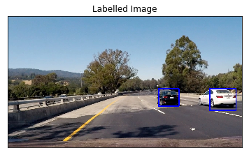

# Vehicle Detection Project
The goals / steps of this project are the following:

* Perform a Histogram of Oriented Gradients (HOG) feature extraction on a labeled training set of images and train a classifier Linear SVM classifier
* Optionally, you can also apply a color transform and append binned color features, as well as histograms of color, to your HOG feature vector. 
* Note: for those first two steps don't forget to normalize your features and randomize a selection for training and testing.
* Implement a sliding-window technique and use your trained classifier to search for vehicles in images.
* Run your pipeline on a video stream (start with the test_video.mp4 and later implement on full project_video.mp4) and create a heat map of recurring detections frame by frame to reject outliers and follow detected vehicles.
* Estimate a bounding box for vehicles detected.

## Histogram of Oriented Gradients (HOG)

### 1. Explain how (and identify where in your code) you extracted HOG features from the training images.

#### Hog Feature

HOG[Histogram of Oriented Gradient](https://en.wikipedia.org/wiki/Histogram_of_oriented_gradients) is widely used in object detection. In this project, I started reading vehicles and non-vehicles images provided by Udacity. Then I use `skimage.feature.hog` to calculate the HOG feature of an image.

The functions for HOG feature extraction can be found in `hog.py`, and this step is contained in the line #2 of the file called `model_training.ipynb`.

Here is examples of two of each of the `vehicle` and `non-vehicle` classes:


I then explored different color spaces and different `skimage.hog()` parameters (`orientations`, `pixels_per_cell`, and `cells_per_block`).  I grabbed random images from each of the two classes and displayed them to get a feel for what the `skimage.hog()` output looks like.

Here is examples using the `YCrCb` color space and HOG parameters of `orientations=8`, `pixels_per_cell=(8, 8)` and `cells_per_block=(2, 2)`:


### 2. Explain how you settled on your final choice of HOG parameters.

For spatial bin and color histogram feature, I used the parameters mentioned in the lecture. For the color space, I use `YCrCb`. Here's the parameters I use.

|     Feature     |                     Parameters                     |
| :-------------: | :------------------------------------------------: |
|   Color Space   |                       YCrCb                        |
|       HOG       | orient=9 <br/>pix_per_cell=8 <br/>cell_per_block=2 |
| Color Histogram |                    hist_bins=32                    |
|   Spatial Bin   |                spatial_size=(32,32)                |

 This step is contained in the line #2 of the file called `model_training.ipynb`.


```python
color_space='YCrCb'
spatial_size=(32, 32)
hist_bins=32
orient=9
pix_per_cell=8
cell_per_block=2
hog_channel='ALL'
spatial_feat=True
hist_feat=True
hog_feat=True
```


#### 3. Describe how (and identify where in your code) you trained a classifier using your selected HOG features (and color features if you used them).

#### Pre-processing

##### Standard Scaler

Use `sklearn.preprocessing.StandardScaler()` to normalize the feature vectors for training the classifier. Then apply the same scaling to each of the feature vectors I extract from windows in the test images.

- Fit a column scaler
  - `X_scaler = StandardScaler().fit(X)`
- Apply the scaler to X
  - `scaled_X = X_scaler.transform(X)`

 This step is contained in the line #3 of the file called `model_training.ipynb`.

#### Train-Test Split

- Split the train data and test dataset

```python
train_test_split(scaled_X, y, test_size=0.2, stratify=y)
```

 This step is contained in the line #4 of the file called `model_training.ipynb`.

#### Model Training

##### [LinearSVC](http://scikit-learn.org/stable/modules/generated/sklearn.svm.LinearSVC.html)

To train the model, I use `LinearSVC` model of sklearn with default setting of parameters. The default penalty is `l2` normalization.

```python
LinearSVC(penalty=’l2’, loss=’squared_hinge’, dual=True, tol=0.0001, C=1.0, multi_class=’ovr’, fit_intercept=True, intercept_scaling=1, class_weight=None, verbose=0, random_state=None, max_iter=1000)
```

 This step is contained in the line #5 of the file called `model_training.ipynb`.

- Test Accuracy of SVC
  - 99.21%

## Sliding Window Search

### 1. Describe how (and identify where in your code) you implemented a sliding window search.  How did you decide what scales to search and how much to overlap windows?

#### Sliding Window Search

I load the svc model and using `find_cars()` in [hog.py](https://github.com/jeongwhanchoi/CarND-Vehicle-Detection/blob/master/hog.py). The `find_cars` only has to extract hog features once, for each of a small set of predetermined window sizes (defined by a scale argument), and then can be sub-sampled to get all of its overlaying windows. Each window is defined by a scaling factor that impacts the window size. The scale factor can be set on different regions of the image (e.g. small near the horizon, larger in the center).

For our example are using a 64 x 64 base window. If we define pixels per cell as 8 x 8, then a scale of 1 would retain a window that's 8 x 8 cells (8 cells to cover 64 pixels in either direction). 


Code with multi-scale window search and heatmap to reduce false positives have been implemented in the class `VehicleDetector` in [detector.py](https://github.com/jeongwhanchoi/CarND-Vehicle-Detection/blob/master/detector.py) and is discussed in the sections below. 

The hog sub-sampling helps to reduce calculation time for finding HOG features and thus provided higher throuhput rate. The images below are the sample ouputs.


### 2. Show some examples of test images to demonstrate how your pipeline is working.  What did you do to optimize the performance of your classifier?

#### Multi-Scale Search

An overlap of each window can be defined in terms of the cell distance, using `cells_per_step`. This means that a `cells_per_step` = 2 would result in a search window overlap of 75% (2 is 25% of 8, so we move 25% each time, leaving 75% overlap with the previous window). Any value of scale that is larger or smaller than one will scale the base image accordingly, resulting in corresponding change in the number of cells per window. Its possible to run this same function multiple times for different scale values to generate multiple-scaled search windows.

 This step is contained in the line #3 of the file called `detection.ipynb`. The following scales were empirically decided each having a overlap of 75%(decided by `cells_per_step` which is set as 2).

##### Scale 1

```python
ystart = 380
ystop = 480
scale = 1
```


##### Scale 2

```python
ystart = 400
ystop = 600
scale = 1.5
```


##### Scale 3

```python
ystart = 500
ystop = 700
scale = 2.5
```


##### Final Scale

```python
ystart = 400
ystop = 656
scale = 1.5
```


## Video Implementation

### 1. Provide a link to your final video output.  Your pipeline should perform reasonably well on the entire project video (somewhat wobbly or unstable bounding boxes are ok as long as you are identifying the vehicles most of the time with minimal false positives.)
Here's a link to my video result:

- [test_video_output.mp4](https://github.com/jeongwhanchoi/CarND-Vehicle-Detection/blob/master/test_video_output.mp4)
- [project_video_output.mp4](https://github.com/jeongwhanchoi/CarND-Vehicle-Detection/blob/master/project_video_output.mp4)

### 2. Describe how (and identify where in your code) you implemented some kind of filter for false positives and some method for combining overlapping bounding boxes.

#### Avoiding False Positives and Label Detection

##### Original Image

The image below show the rectangles retured by `find_cars` drawn onto one of the test images in the final implementation. Notice that there are several positive predictions on each of the near-field cars.


##### Heatmap

Because a true positive is typically accompanied by several positive detections, while false positives are typically accompanied by only one or two detections, a combined heatmap and threshold is used to differentiate the two. The `add_heatmap_and_threshold()` function increments the pixel value (reffered to as "heat") of an all-black image the size of the original image at the location of each detection rectangle. Areas encompassed by more overlapping rectangles are assigned higher levels of heat. The following image is the resulting heatmap from the detections in the image above. 


##### Thresholded Heatmap

```python
vehicleDetector.threshold = 3
```

A threshold is applied to the heatmap, setting all pixels that don't exceed the threshold to zero. The result is below:


##### Restricted Search

The search was optimized by processing complete frames only once every 10 frames, and by having a restricted search in the remaining frames. The restricted search is performed by appending 50 pixel to the heatmap found in last three frames. Look at the implementation of `find_cars` method of `VehicleDetector` in [detector.py](https://github.com/jeongwhanchoi/CarND-Vehicle-Detection/blob/master/detector.py). The `scipy.ndimage.measurements.label()` function collects spatially contiguous areas of the heatmap and assigns each a label:


##### Labelled Image

And the final detection area is set to the extremities of each identified label:



---

## Discussion

#### 1. Briefly discuss any problems / issues you faced in your implementation of this project.  Where will your pipeline likely fail?  What could you do to make it more robust?

- I started out with a [LinearSVC](http://scikit-learn.org/stable/modules/generated/sklearn.svm.LinearSVC.html) due to its fast evaluation. Nonlinear kernels such as `rbf` take not only longer to train, but also much longer to evaluate. 
- I use `sklearn.preprocessing.StandardScaler()` to normalize the feature vectors for training the classifier. Then apply the same scaling to each of the feature vectors I extract from windows in the test images.
- The multi-window search may be optimized further for better speed and accuracy.

Here I'll talk about how I might improve it if I were going to pursue this project further.  

- Useing a CNN(Convolutional Neural Network) to preclude the sliding window serach altogether might provided better results.